# CartoonShader
Cartoon Shader for Unreal and Unity that gives the scene a comic book / cartoon render

# Unreal
Use:

Copy Unreal Shader Material in Unreal Folder into your project

Create a Post Processor Actor in your Scene,

In Post Processor settings,

    Enable Infinite Extent (Unbound)

    Under Post Processing Materials, add AssetRef and select the CellShader Material

# Unity

# Unreal ScreenShots

Before / After:

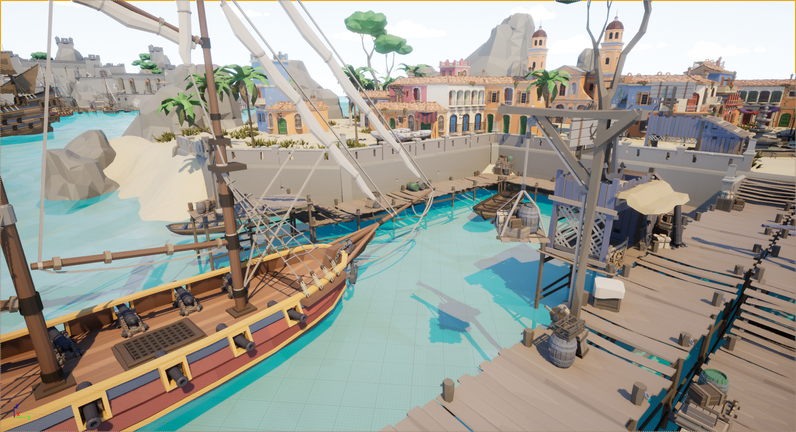 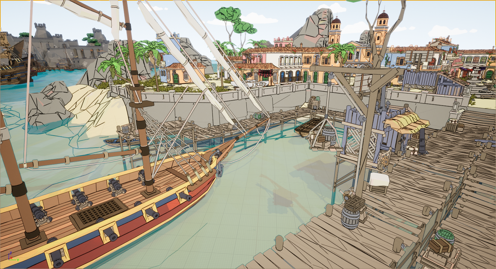

 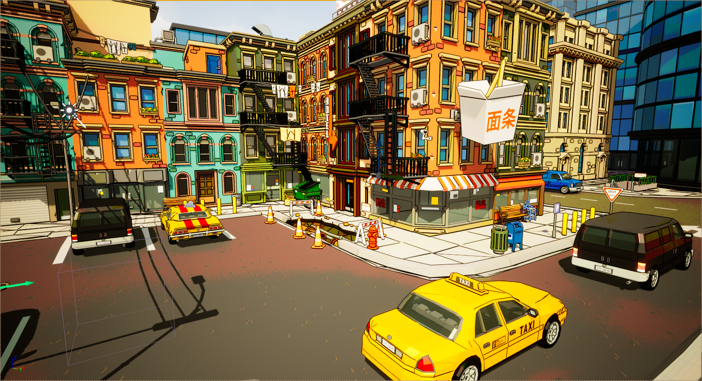

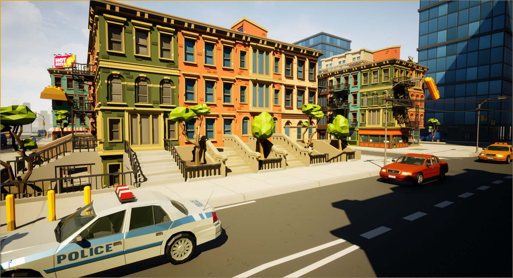 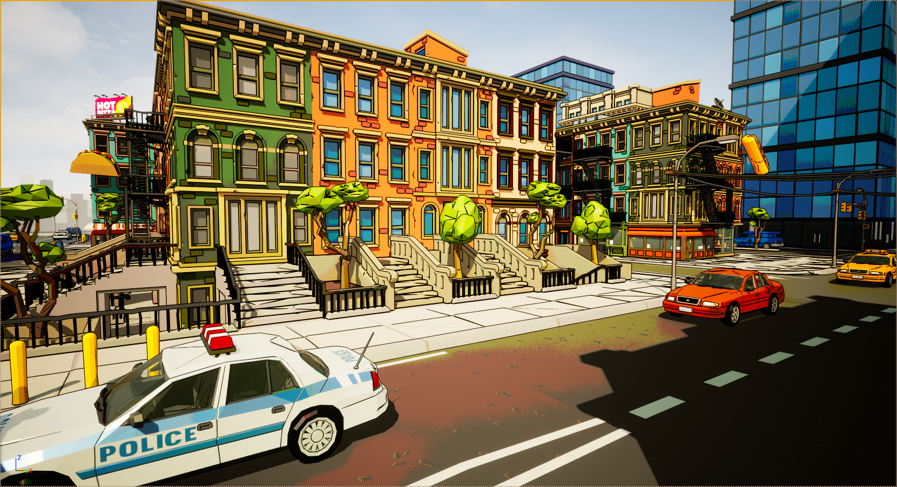

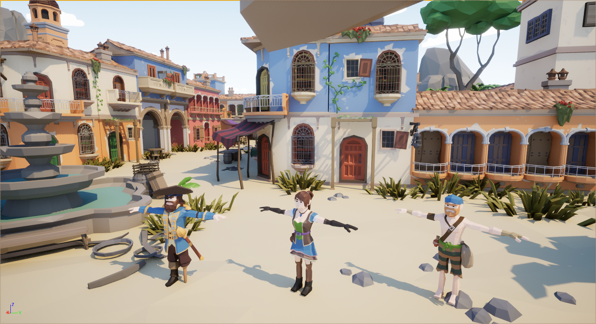 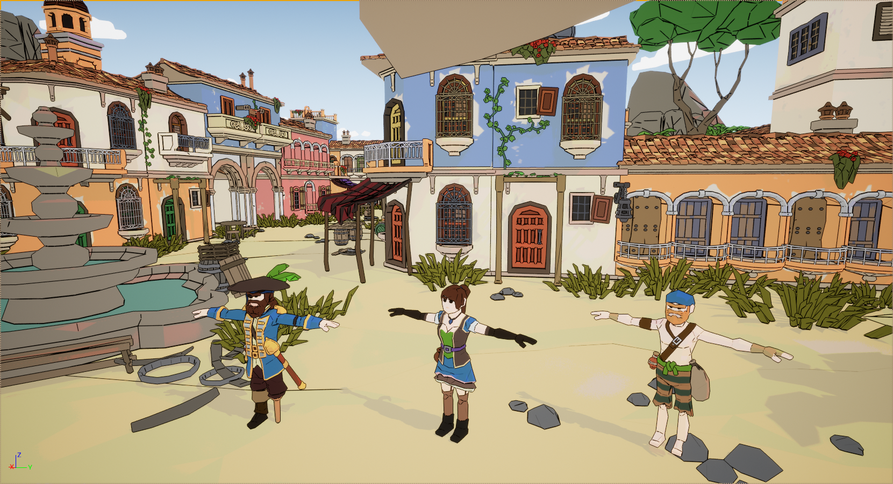

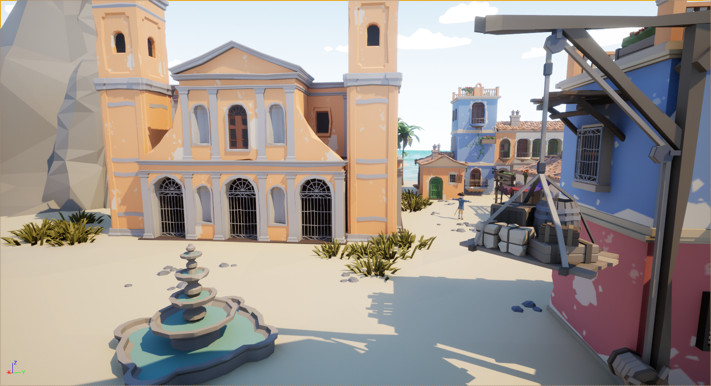 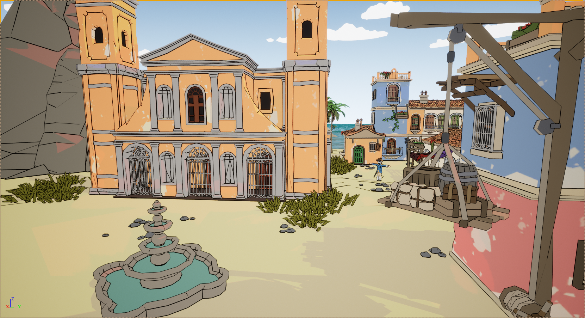

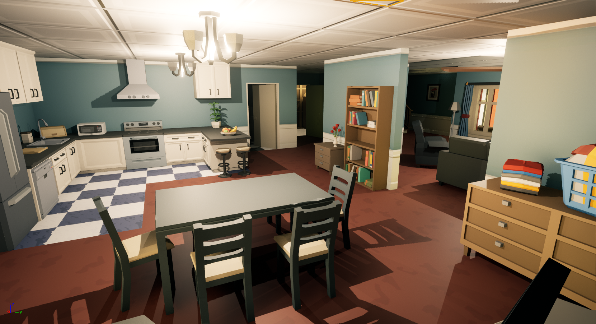 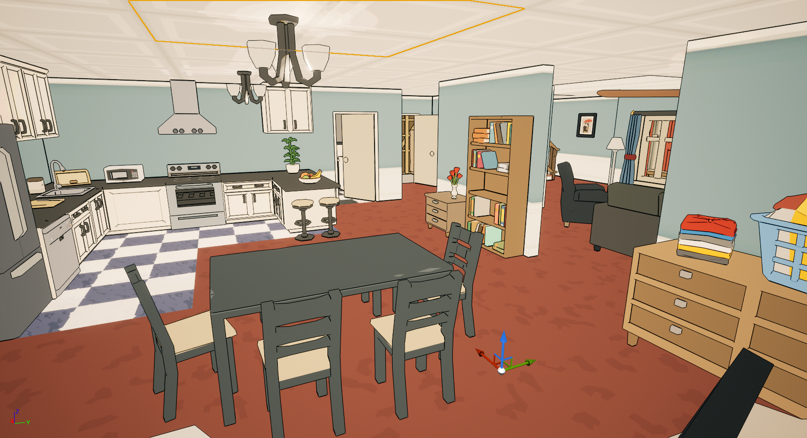

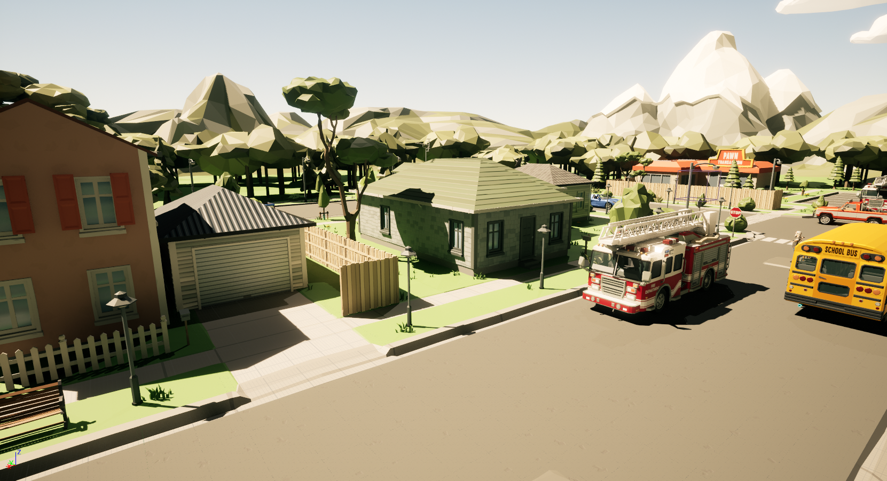 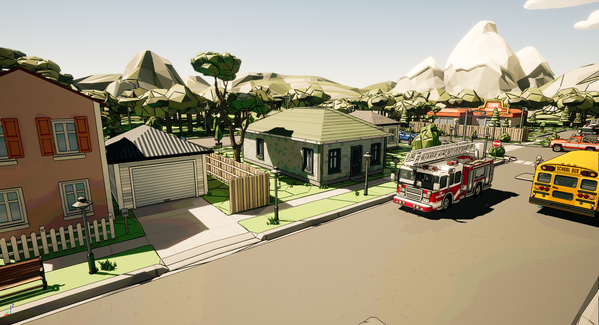

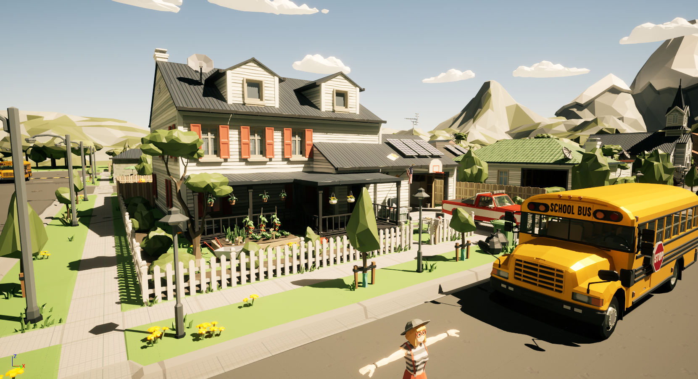 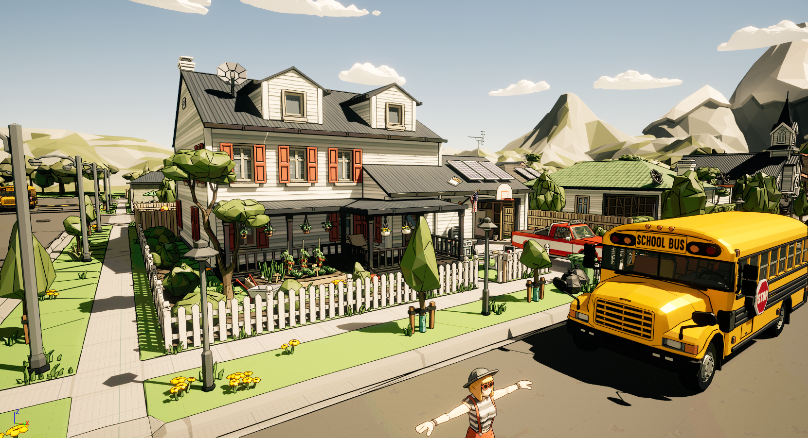
#

