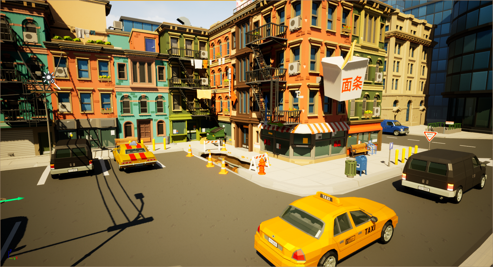

# CartoonShader
Cartoon Shader for Unreal and Unity that gives the scene a comic book / cartoon render

# Unreal
Use:

Copy Unreal Shader Material in Unreal Folder into your project

Create a Post Processor Actor in your Scene,

In Post Processor settings,

    Enable Infinite Extent (Unbound)

    Under Post Processing Materials, add AssetRef and select the CellShader Material

# Unity

Use: 
URP and embedded only
Copy Unity shader and material into your project.

Add to Render pipeline as a FullScreenRenderShader using the cel Shader material. This is done by adding 
a FullSceneRenderComponent to the URP render settings and selecting the material

# Unreal ScreenShots

Before / After:

 

 

 

 

 

 

 

 
#

